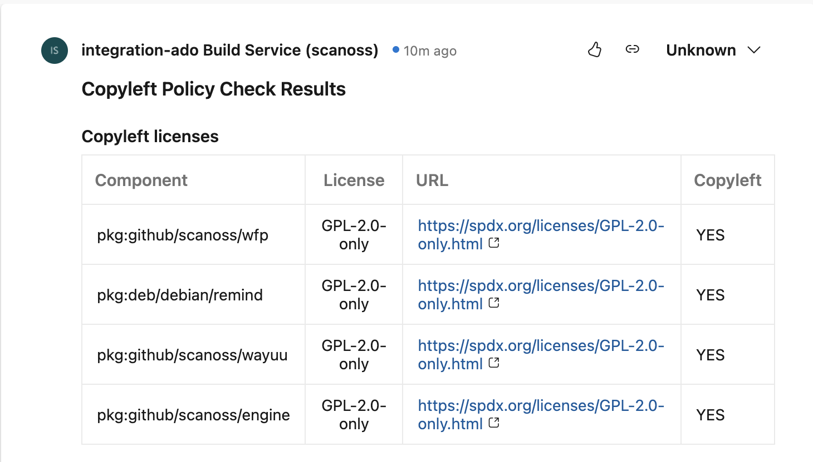

# SCANOSS Code Scan Task
The SCANOSS Code Scan task enhances your software development process by automatically scanning your code for security vulnerabilities and license compliance with configurable policies.

## Usage

To begin using this task, you'll need to set up a basic Pipeline and define a task within it:

```yaml
trigger: none

pr:
  - master

pool:
  vmImage: ubuntu-latest

steps:
  - checkout: self
    persistCredentials: true

  - task: scanoss@0
    displayName: "SCANOSS Code Scan"
    inputs:
     # apiKey: $(APIKEY)
     # apiUrl: 'https://api.scanoss.com/scan/direct'
      sbomFilepath: SBOM.json
      policies: copyleft,undeclared
      policiesHaltOnFailure: false
```

### Action Input Parameters

| **Parameter**         | **Description**                                                                    | **Required** | **Default**                             | 
|-----------------------|------------------------------------------------------------------------------------|--------------|-----------------------------------------|
| outputFilepath        | Scan output file name.                                                             | Optional     | `results.json`                          |
| sbomEnabled           | Enable or disable scanning based on the SBOM file                                  | Optional     | `true`                                  |
| sbomFilepath          | Filepath of the SBOM file to be used for scanning                                  | Optional     | `sbom.json`                             |
| sbomType              | Type of SBOM operation: either 'identify' or 'ignore                               | Optional     | `identify`                              |
| dependenciesEnabled   | Option to enable or disable scanning of dependencies.                              | Optional     | `false`                                 |
| policies              | List of policies separated by commas, options available are: copyleft, undeclared. | Optional     | -                                       |
| policiesHaltOnFailure | Halt check on policy failure. If set to false checks will not fail.                | Optional     | `true`                                  |
| apiUrl                | SCANOSS API URL                                                                    | Optional     | `https://api.osskb.org/scan/direct` |
| apiKey                | SCANOSS API Key                                                                    | Optional     | -                                       |


## Policy Checks
The SCANOSS Code Scan Task includes two configurable policies:

1. Copyleft: This policy checks if any component or code snippet is associated with a copyleft license. If such a
   license is detected, the pull request (PR) is rejected.

2. Undeclared: This policy compares the components detected in the repository against those declared in an sbom.json
   file (customizable through the sbom.filepath parameter). If there are undeclared components, the PR is rejected.

In this scenario, a classic policy is executed that will fail if copyleft licenses are found within the results:


Additionally, if it is a Pull Request, a comment with a summary of the report will be automatically generated.





# Deployment Guide

This guide provides step-by-step instructions for deploying a new package for your project. Ensure all steps are followed to maintain version consistency and successful deployment.

## Prerequisites

- **Node.js**: Ensure Node.js and npm are installed.
- **Azure DevOps Extension Tool (tfx)**: Install the TFS cross-platform command-line interface (`tfx`).
- **jq**: Install `jq` for JSON processing.

## Tests 
Before building the app, run test suites.
``` bash
make test
```

## Build the App
Before creating a new package, ensure to update the version in the **package.json** file. Then, run the following command to build the app:

``` bash
make build
```
